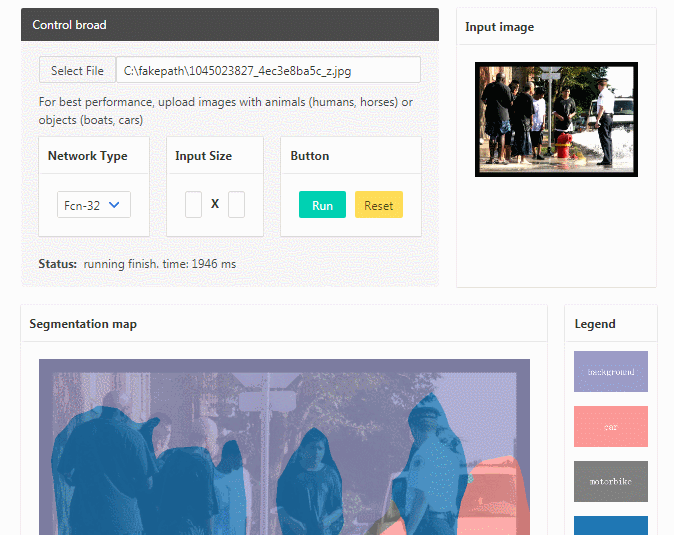

# browser-semantic-segmentation

This program is a Real-time semantic segmentation model which runing in the browser by TensorFlow.js. The model use MobileNet as feature extractor (aka encoder ) architectures and use Fcn as the segmentation (aka decoder) architectures.

[Try the demo here!](http://www.acgtrip.com/demo/semanticDemo.html)



## Installation

You can use this as standalone es5 bundle like this:

```html
		<script src="https://cdn.jsdelivr.net/npm/@tensorflow/tfjs@1.0.0"></script>
		<script src="http://www.acgtrip.com/static/semanticDemo/util.js"></script>
		<script src="http://www.acgtrip.com/static/semanticDemo/ModelWeights.js"></script>
		<script src="http://www.acgtrip.com/static/semanticDemo/mobileNet.js"></script>
		<script src="http://www.acgtrip.com/static/semanticDemo/semanticSegmentation.js"></script>
```

For the convenience of debugging, we haven't packaged or compressed the code.

## Usage

This program can segment 21 types of semantics or only segment the person.
Each methodology has similar input parameters with different outputs.
Besice, the program alse provides two segmentation architectures,FCN-16 or FCN-32.

### Loading a pre-trained BodyPix Model

To get started, a model must be loaded from a checkpoint:

```javascript
var network=new SemanticSegmentation(modelAddress,modelPixels);
await network.load()
```

#### Inputs

**modelAddress** the address of the cheakpoint. you can find one cheakpoint at [here](https://github.com/MemoriesOff/github_blog/tree/gh-pages/static/semanticDemo/web_model).All files in the folder is necessary and the modelAddress means the route of the "model.json". For example, if you want to use our model weight, the modelAddress can be given as "http://www.acgtrip.com/static/semanticDemoweb_model/model.json".

**modelPixels** the shape of the inputLayer of the model, The struct is \[Height, Width\]. it will change the input image to the given shape without change the aspect ratio of the picture by adding some extra pixels. The larger the value, the larger the size of the layers, and more accurate the model at the cost of speed.  Set this to a smaller value to increase speed at the cost of accuracy.

### Semantic-Segmentation

```javascript
var network=new SemanticSegmentation(modelAddress,modelPixels);
await network.load()
var netOutput=await network.predict(image,isOnlyPerson,isFcn32).data();
```
#### Inputs

**image** - ImageData|HTMLImageElement|HTMLCanvasElement|HTMLVideoElement
 The input image to feed through the network.
 
**isOnlyPerson** if it is true, the model works in the person segment mode, if it is false, the model works in the semantic segment mode. the semantic segment mode will be more accuracy but costs more time.

**isFcn32** if it is true, it uses the FCN32 net,else it uses the FCN16 net, FCN32 mode will be more accuracy but costs more time.

#### return
The model can segments an image into pixels that are and aren't part of a person or can segments the 21 types of semantics. if you choose the person segmentation, the output will be a array with the probability of whether this pixel is a human. if you choose the semantic segmentation, the function will return a array with ids for one of 21 semantics. The array size corresponds to the number of pixels in the input image under both situation.

| Part Id | Part Name          |
|---------|--------------------|
| 0       | background         |
| 1       | aeroplane          |
| 2       | bicycle            |
| 3       | bird               |
| 4       | boat               |
| 5       | bottle             |
| 6       | bus                |
| 7       | car                |
| 8       | cat                |
| 9       | chair              |
| 10      | cow                |
| 11      | dog                |
| 12      | horse              |
| 13      | motorbike          |
| 14      | person             |
| 15      | potted-plant       |
| 16      | sheep              |
| 17      | sofa               |
| 18      | train              |
| 19      | tv/monitor         |
| 20      | ambigious          |

## Developing the Demos

The index.html file is in [there](https://github.com/MemoriesOff/github_blog/blob/gh-pages/demo/semanticDemo.html) and others are in [here](https://github.com/MemoriesOff/github_blog/tree/gh-pages/static/semanticDemo)

## Acknowledgement

The tfjs implementation of the mobileNet model is refer to [body-pix](https://github.com/tensorflow/tfjs-models/tree/7481b941c26edae6b963042b8e260123984532a5/body-pix) and the model weights come from [seg-mentor](https://github.com/hailotech/seg-mentor)

## License
The sourse code is licensed Apache License, Version 2.0 and the model weights is licensed MIT.
